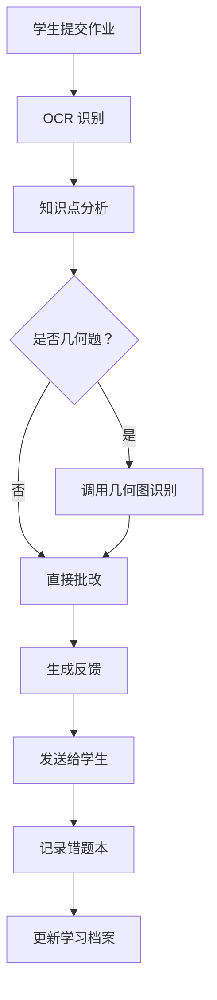
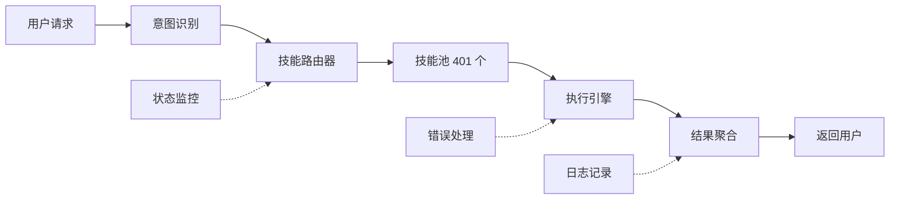

# TX1.0 工业自动化流程引擎

**版本：** v1.0  
**创建时间：** 2026-03-20  
**作者：** TX1.0

---

## 🎯 概述

基于工业自动化流程图思维设计的核心流程引擎技能。整合 401 个技能，实现高效、简洁、自动化的流程执行。

### 设计理念

| 工业概念 | 技能映射 |
|----------|----------|
| **输入站** | 用户请求/事件触发 |
| **处理单元** | 技能执行节点 |
| **传送带** | 数据流/上下文传递 |
| **质检站** | 结果验证/错误处理 |
| **输出站** | 最终交付物 |
| **PLC 控制器** | 流程引擎核心 |
| **传感器** | 状态监控/心跳 |
| **反馈回路** | 持续优化循环 |

---

## 🏗️ 架构设计

### 三层架构

```
┌─────────────────────────────────────────────────────────┐
│                   应用层 (Application)                   │
│  家教流程 | 研究流程 | 创作流程 | 自动化流程 | 监控流程  │
└─────────────────────────────────────────────────────────┘
                            ↓
┌─────────────────────────────────────────────────────────┐
│                   引擎层 (Engine Core)                   │
│  流程解析器 | 技能调度器 | 状态管理器 | 错误处理器      │
└─────────────────────────────────────────────────────────┘
                            ↓
┌─────────────────────────────────────────────────────────┐
│                   执行层 (Execution)                     │
│  401 个技能 | 工具调用 | API 集成 | 文件操作 | 网络请求   │
└─────────────────────────────────────────────────────────┘
```

### 流程元模型

```yaml
Flow:
  id: string              # 流程 ID
  name: string            # 流程名称
  version: string         # 版本号
  trigger: Trigger        # 触发器
  nodes: [Node]           # 节点列表
  edges: [Edge]           # 连接关系
  variables: {}           # 流程变量
  error_handler: Handler  # 错误处理
  
Node:
  id: string              # 节点 ID
  type: enum              # 节点类型 (skill/task/decision/merge/end)
  skill: string           # 技能名 (type=skill 时)
  input: {}               # 输入参数
  output: {}              # 输出映射
  retry: int              # 重试次数
  timeout: int            # 超时时间
  
Edge:
  from: string            # 起始节点
  to: string              # 目标节点
  condition: string       # 条件表达式 (可选)
```

---

## 📦 核心功能

### 1. 流程定义

```python
# 定义一个家教批改流程
flow = FlowEngine.define(
    id="tutor_grading_v1",
    name="学生作业批改流程",
    trigger="student_submit_homework",
    nodes=[
        Node(id="receive", type="task", action="receive_homework"),
        Node(id="ocr", type="skill", skill="paddleocr-doc-parsing"),
        Node(id="analyze", type="skill", skill="TX1.0-educational-psychology"),
        Node(id="grade", type="skill", skill="tencentcloud-ocr-questionmarkagent"),
        Node(id="feedback", type="skill", skill="TX1.0-social-communication"),
        Node(id="record", type="skill", skill="knowledge-distill"),
    ],
    edges=[
        Edge(from="receive", to="ocr"),
        Edge(from="ocr", to="analyze"),
        Edge(from="analyze", to="grade"),
        Edge(from="grade", to="feedback"),
        Edge(from="feedback", to="record"),
    ]
)
```

### 2. 流程执行

```python
# 执行流程
result = FlowEngine.execute(
    flow_id="tutor_grading_v1",
    input={"homework": "math_2024_problem3.jpg"},
    context={"student_id": "stu001", "subject": "math"}
)
```

### 3. 状态监控

```python
# 查询流程状态
status = FlowEngine.get_status(flow_instance_id="inst_12345")
# 返回：{"status": "running", "current_node": "grade", "progress": 60%}
```

### 4. 错误处理

```python
# 配置错误处理策略
flow.error_handler = ErrorHandler(
    retry_count=3,
    retry_delay=5,
    fallback_node="manual_review",
    notification="feishu"
)
```

---

## 🔄 内置流程模板

### 家教主线流程

```
学生提问 → 问题分类 → 知识检索 → 解答生成 → 验证准确性 → 发送答案 → 记录错题
   ↓          ↓           ↓           ↓           ↓           ↓          ↓
 receive  classify   search    generate    verify     send     record
```

### 试卷生成流程

```
选择知识点 → 难度设定 → 题目检索 → 组卷 → 格式转换 → 生成 Word → 存档
    ↓          ↓          ↓         ↓         ↓          ↓         ↓
  select    difficulty  search   compose   convert   word     archive
```

### 技能调用流程

```
用户请求 → 意图识别 → 技能匹配 → 参数准备 → 执行技能 → 结果处理 → 返回
   ↓          ↓           ↓           ↓          ↓           ↓         ↓
 request   intent     match      prepare    execute    process   return
```

### 自动化监控流程

```
定时触发 → 状态检查 → 异常检测 → 告警判断 → 发送通知 → 记录日志
   ↓          ↓           ↓           ↓          ↓          ↓
 trigger    check      detect     alert     notify     log
```

---

## 🎛️ 使用方法

### 基础使用

```bash
# 1. 定义流程
python3 TX1.0-flow-engine.py define --file flow.yaml

# 2. 执行流程
python3 TX1.0-flow-engine.py execute --flow tutor_grading_v1 --input homework.jpg

# 3. 查看状态
python3 TX1.0-flow-engine.py status --instance inst_12345

# 4. 列出流程
python3 TX1.0-flow-engine.py list

# 5. 删除流程
python3 TX1.0-flow-engine.py delete --flow flow_id
```

### 高级使用

```bash
# 并行执行多个流程
python3 TX1.0-flow-engine.py execute --flow batch_grading --inputs *.jpg --parallel 5

# 流程调试（单步执行）
python3 TX1.0-flow-engine.py debug --flow tutor_grading_v1 --step-by-step

# 流程性能分析
python3 TX1.0-flow-engine.py profile --flow tutor_grading_v1

# 导出流程图
python3 TX1.0-flow-engine.py export --flow tutor_grading_v1 --format mermaid
```

---

## 📊 流程图示例

### 家教批改流程（Mermaid）



### 技能调度架构



---

## 🔧 配置示例

### 流程配置文件 (flow.yaml)

```yaml
flow:
  id: "tutor_grading_v1"
  name: "学生作业批改流程"
  version: "1.0"
  
trigger:
  type: "feishu_message"
  pattern: "提交作业|交作业|批改"

nodes:
  - id: "receive"
    type: "task"
    action: "receive_homework"
    timeout: 30
    
  - id: "ocr"
    type: "skill"
    skill: "paddleocr-doc-parsing"
    input:
      image: "${receive.file}"
    timeout: 60
    
  - id: "analyze"
    type: "skill"
    skill: "TX1.0-educational-psychology"
    input:
      text: "${ocr.text}"
      student_id: "${context.student_id}"
    timeout: 30
    
  - id: "grade"
    type: "skill"
    skill: "tencentcloud-ocr-questionmarkagent"
    input:
      content: "${ocr.text}"
      subject: "${analyze.subject}"
    timeout: 60
    
  - id: "feedback"
    type: "skill"
    skill: "TX1.0-social-communication"
    input:
      result: "${grade.result}"
      tone: "encouraging"
    timeout: 30
    
  - id: "record"
    type: "skill"
    skill: "knowledge-distill"
    input:
      content: "${grade.result}"
      category: "wrong_question"
    timeout: 30

edges:
  - from: "receive"
    to: "ocr"
  - from: "ocr"
    to: "analyze"
  - from: "analyze"
    to: "grade"
  - from: "grade"
    to: "feedback"
  - from: "feedback"
    to: "record"

error_handler:
  retry_count: 3
  retry_delay: 5
  fallback_node: "manual_review"
  notification:
    type: "feishu"
    recipient: "ou_6411571988fd02748bc696e0f01a489e"
```

---

## 📈 性能优化

### 1. 技能缓存

```python
# 启用技能结果缓存
FlowEngine.enable_cache(
    ttl=3600,  # 缓存 1 小时
    max_size=1000
)
```

### 2. 并行执行

```python
# 并行执行独立节点
FlowEngine.set_parallel(
    max_workers=5,
    queue_size=100
)
```

### 3. 资源限制

```python
# 限制资源使用
FlowEngine.set_limits(
    max_memory="2GB",
    max_cpu=4,
    max_concurrent_flows=10
)
```

---

## 🎯 应用场景

### 家教场景
- ✅ 作业批改流程
- ✅ 试卷生成流程
- ✅ 知识点讲解流程
- ✅ 错题复习流程

### 研究场景
- ✅ 文献检索流程
- ✅ 数据分析流程
- ✅ 报告生成流程

### 自动化场景
- ✅ 定时任务流程
- ✅ 监控告警流程
- ✅ 数据同步流程

### 创作场景
- ✅ 内容生成流程
- ✅ 多平台发布流程
- ✅ SEO 优化流程

---

## 📝 测试用例

```python
# 测试流程定义
def test_flow_definition():
    flow = FlowEngine.define_from_yaml("test_flow.yaml")
    assert flow.id == "test_flow"
    assert len(flow.nodes) == 5
    
# 测试流程执行
def test_flow_execution():
    result = FlowEngine.execute("tutor_grading_v1", {"homework": "test.jpg"})
    assert result.status == "success"
    assert result.output["feedback"] is not None
    
# 测试错误处理
def test_error_handling():
    flow.error_handler.retry_count = 3
    result = FlowEngine.execute("failing_flow", {})
    assert result.status == "failed"
    assert result.retry_count == 3
```

---

## 🔐 安全考虑

1. **技能权限** — 每个技能执行前检查权限
2. **输入验证** — 所有输入参数进行验证
3. **超时保护** — 防止无限循环
4. **资源限制** — 防止资源耗尽
5. **日志审计** — 所有操作记录日志

---

## 📚 参考书籍

- 《工业自动化系统设计与应用》
- 《PLC 编程与应用》
- 《流程引擎设计与实现》
- 《工作流模式》
- 《企业应用架构模式》

---

**最后更新：** 2026-03-20  
**状态：** ✅ 已创建，待测试
